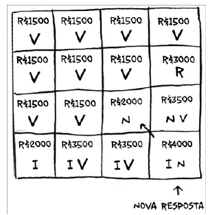
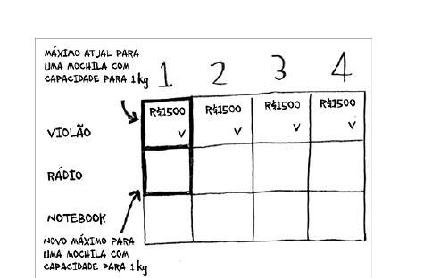
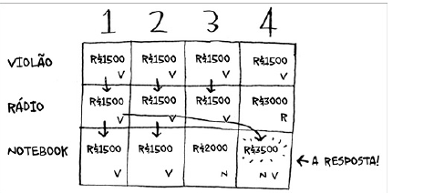

# Programação dinamica

# Programação Dinâmica

## Como Funciona

A programação dinâmica é uma técnica de resolução de problemas que funciona através da decomposição do problema original em subproblemas mais simples. O algoritmo começa resolvendo esses subproblemas menores e, gradualmente, combina suas soluções para resolver o problema completo.

O processo segue estas etapas:
1. Dividir o problema em subproblemas menores
2. Resolver cada subproblema uma única vez e armazenar suas soluções
3. Reutilizar as soluções dos subproblemas para construir a solução final

## Exemplo: O Problema da Mochila

No clássico problema da mochila, você começaria resolvendo o problema para capacidades menores (ou "submochilas") e, gradualmente, expandiria a solução até resolver o problema para a capacidade total da mochila.

Esta abordagem elimina cálculos redundantes e permite encontrar a solução ótima de maneira eficiente, combinando as soluções ótimas dos subproblemas.

Funciona como uma especie de "cache" para os subproblemas, evitando que você tenha que resolvê-los mais de uma vez.

Funciona basicamnete como uma tabela de memorização, onde você armazena os resultados dos subproblemas para não precisar recalculá-los.

Como por exemplo uma mochila para carregar os iens mais valiosos, mas com um peso máximo que a mochila pode carregar, calculamos o valor para cada item e para cada peso, e armazenamos em uma tabela, para que não seja necessário recalcular o valor para um item que já foi calculado, quando adicionamos um novo item, usamos a tabela para regatar o valor do item anterior e somamos com o novo item.

Algoritmos dinamicos não são apropriados para problemas com frações, não existe levar parte de um iten, ou levar um item pela metade, ou seja, ou você leva o item ou não leva.

A programação dinâmica não resolve problemas relacionados a valores que não são discretos, ou seja, aqueles onde os subproblemas não são independentes entre si e são afetados pelo resultado de outros subproblemas.

## Notas

* A programação dinâmica é útil quando estamos tentando otimizar algo em relação a um limite
* Você pode utilizar programação dinâmica quando existem subproblemas que podem ser resolvidos de forma independente
* Toda programação dinâmica envolve o uso de tabelas
* Os valores das células são geralmente o que você está tentando otimizar
* Cada célula é um subproblema, e a entrada para cada subproblema é a saída de outro subproblema
* A programação dinâmica é eficiente quando o número de subproblemas é razoavelmente pequeno

## Recapitulando

* A programação dinâmica é útil quando você está tentando otimizar algo em relação a um limite
* Você pode usar programação dinâmica quando você pode separar seu problema em subproblemas discretos, ou seja, não existe dependência entre os problemas
* Todas as programações dinâmicas envolvem uma tabela
* Não existe uma forma única para calcular uma solução para programação dinâmica, é muito mais uma modelagem do problema, e a partir disso você pode criar uma solução para o problema utilizando de programação dinâmica
