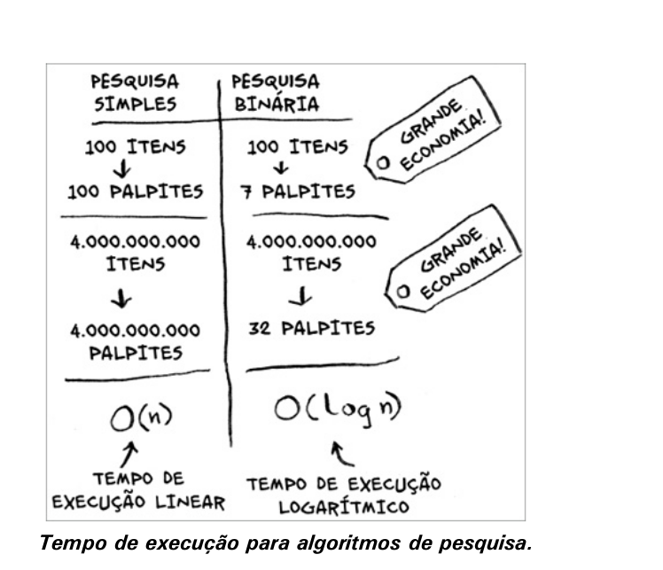
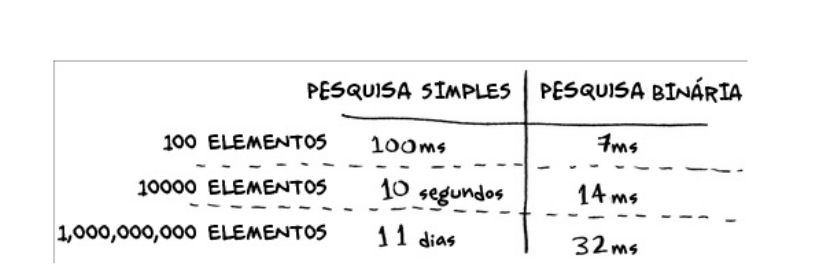

# Pesquisa binaria

 A pesquisa binária é um algoritmo. Sua entrada é uma lista ordenada de elementos (explicarei mais tarde por que motivo a lista precisa ser ordenada). Se o elemento que você está buscando está na lista, a pesquisa binária retorna a sua localização. Caso contrário, a pesquisa binária retorna None.

Com a pesquisa binária, você chuta um número intermediário e elimina a metade dos números restantes a cada vez.

# EXERCÍCIOS

## 1.1 Número máximo de etapas para lista com 128 nomes

**Pergunta**: Suponha que você tenha uma lista com 128 nomes e esteja fazendo uma pesquisa binária. Qual seria o número máximo de etapas que você levaria para encontrar o nome desejado?

**Solução**:
A pesquisa binária divide a lista ao meio em cada etapa, reduzindo o número de elementos pela metade. O número máximo de etapas para uma lista de n elementos é [log₂(n)].

### Cálculo de log₂(128):
Para resolver log₂(128), perguntamos: "2 elevado a qual potência é igual a 128?"

2ⁿ = 128

Decomposição:
* 2¹ = 2
* 2² = 4
* 2³ = 8
* 2⁴ = 16
* 2⁵ = 32
* 2⁶ = 64
* 2⁷ = 128

Portanto, o número máximo de etapas é **7**.

## 1.2 Número máximo de etapas para lista com 256 nomes

**Pergunta**: Suponha que você duplique o tamanho da lista. Qual seria o número máximo de etapas agora?

**Solução**:
Aplicando a mesma lógica para 256 nomes:
* 2⁸ = 256

Portanto, o número máximo de etapas seria **8**.

## Tempo de execução

## Comparação de Pesquisas

Na pesquisa simples, o número máximo de tentativas é igual ao tamanho da lista (tempo linear). Por exemplo, uma lista de 100 números requer 100 tentativas, e uma lista de 4 bilhões de números requer 4 bilhões de tentativas.

Na pesquisa binária, o número de tentativas é muito menor (tempo logarítmico). Uma lista de 100 itens requer, no máximo, 7 tentativas, e uma lista de 4 bilhões de itens requer, no máximo, 32 tentativas.

# Notação Big O

A notação Big O é uma maneira de falar sobre o tempo de execução de um algoritmo. A notação Big O nos permite comparar o tempo de execução de diferentes algoritmos sem ter que executá-los.

## Tempode de execução dos algoritmos cresce de forma diferentes

Bob está escrevendo um algoritmo para a NASA que ajudará a calcular o local de pouso de um foguete. Ele está decidindo entre a pesquisa simples e a pesquisa binária. A pesquisa binária é mais rápida, mas a pesquisa simples é mais fácil de escrever. Bob cronometra ambos os algoritmos com uma lista de 100 elementos. A pesquisa simples leva 100 ms, enquanto a pesquisa binária leva 7 ms. Para uma lista de 1 bilhão de elementos, a pesquisa simples levaria 11 dias, enquanto a pesquisa binária levaria apenas 30 ms. Bob decide usar a pesquisa binária.

Conforme o número de itens cresce, a pesquisa binária aumenta seu tempo de execução apenas um pouco, enquanto a pesquisa simples leva muito mais tempo. Bob pensou que a pesquisa binária fosse 15 vezes mais rápida que a pesquisa simples, mas na verdade, para uma lista de 1 bilhão de itens, a pesquisa binária é aproximadamente 33 milhões de vezes mais rápida. A notação Big O ajuda a entender como o tempo de execução de um algoritmo cresce conforme a lista aumenta, permitindo comparar a eficiência dos algoritmos.

## Notação Big O estabelece o tempo de execução para o pior caso

Suponha que você utiliza uma pesquisa simples para procurar um nome em uma agenda telefônica. A pesquisa simples tem tempo de execução O(n), o que significa que, na pior das hipóteses, você verificará cada nome. Mesmo que encontre o nome na primeira tentativa, a notação Big O considera o pior caso, então o tempo de execução ainda é O(n). A notação Big O garante que a pesquisa simples nunca será mais lenta que O(n).

## Notação Big O - Tempos de Execução

### Classificação (do mais rápido ao mais lento)

1. **O(log n)** - Tempo logarítmico
   - Exemplo: Pesquisa binária
   - Para 16 elementos: 4 operações (0.4 segundos)
   - Para 1024 elementos: 10 operações (1 segundo)

2. **O(n)** - Tempo linear
   - Exemplo: Pesquisa simples
   - Para 16 elementos: 16 operações
   - Para 1024 elementos: 1024 operações

3. **O(n * log n)**
   - Exemplo: Quicksort

4. **O(n²)**
   - Exemplo: Ordenação por seleção

5. **O(n!)**
   - Exemplo: Problema do caixeiro-viajante

### Pontos Principais
- A velocidade é medida pelo crescimento do número de operações, não em segundos
- O tempo de execução aumenta conforme o número de elementos
- O(log n) é mais eficiente que O(n) e melhora com o aumento da lista

## EXERCÍCIOS

## Respostas - Tempo de Execução (Big O)

### 1.3 Buscar número por nome
- **Tempo: O(log n)**
- *Justificativa*: Pode usar pesquisa binária pois a agenda está ordenada por nome

### 1.4 Buscar nome por número
- **Tempo: O(n)**
- *Justificativa*: Precisa verificar cada entrada pois a agenda não está ordenada por número

### 1.5 Ler todos os números
- **Tempo: O(n)**
- *Justificativa*: Precisa ler cada entrada uma vez

### 1.6 Ler números dos nomes com 'A'
- **Tempo: O(n)**
- *Justificativa*: Mesmo que os nomes comecem com 'A', ainda precisa verificar toda a lista para encontrar todos os casos

## Caixeiro-viajante
