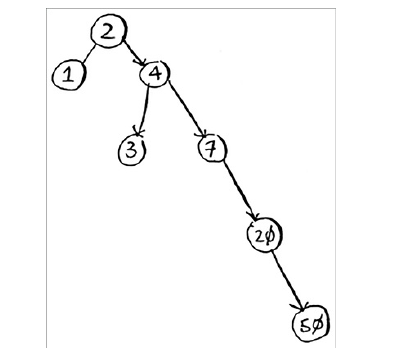
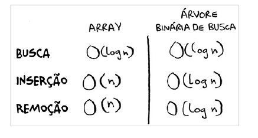

# Proximos passos

## Arvores

As árvores são estruturas de dados que possuem uma raiz, nós e folhas. Elas são utilizadas para armazenar dados de forma hierárquica, como por exemplo, a estrutura de pastas e arquivos de um sistema operacional.

### Arvores Binárias

As árvores binárias são um tipo de árvore onde cada nó possui no máximo dois filhos: um à esquerda e um à direita. Elas são utilizadas em algoritmos de busca e ordenação, como o algoritmo de busca binária.

### desvantagens
Entretanto a árvore binária de busca tem algumas desvantagens: não é
possível utilizar acesso aleatório. Isso faz com que seja impossível dizer, por
exemplo, “Me dê o quinto elemento desta árvore”. Além disso, o bom
desempenho relacionado ao tempo de execução não acontece em todos os
casos, mas sim em uma média, e este tempo de execução é fortemente
dependente da necessidade de a árvore ser balanceada. Imagine que você
tenha uma árvore desbalanceada, como a mostrada a seguir.

### Arvores

* Arvores binarias
* Arvores AVL
* Arvores rubro-negras
* Arvores B
* heap
* Arvores splay

## Indice invertido

O índice invertido é uma estrutura de dados utilizada para indexar palavras em documentos. Ele é utilizado em motores de busca para encontrar documentos que contêm uma determinada palavra.

### MapReduce

MapReduce é um modelo de programação utilizado para processar grandes volumes de dados de forma paralela e distribuída. Ele é utilizado em sistemas de Big Data, como o Hadoop.

#### função map

A função map é utilizada para transformar uma lista de elementos em outra lista de elementos. Ela é utilizada em conjunto com a função reduce para processar grandes volumes de dados.

#### função reduce

A função reduce é utilizada para combinar os resultados de várias operações em um único resultado. Ela é utilizada em conjunto com a função map para processar grandes volumes de dados. com por exemplo somar todos os valores de uma lista.

