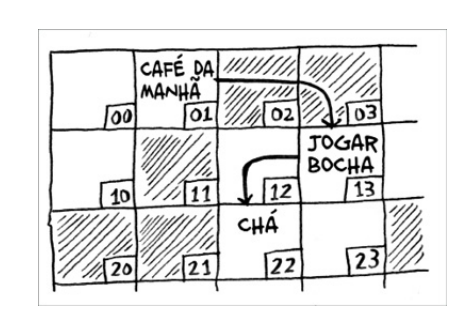

# Ordenação é seleção

## Como funcionar a memoria

Cada vez que um item é armazenado na memória, o solicitante pede para que seja reservado um pouco de espaço, se você pedir para armazenar multiplos itens, existe duas forma de fazer isso: arrays e listas.

## Arrays e listas encadeadas

### Arrays

Arrays são uma coleção de itens armazenados em um bloco de memória contíguo. Isso significa que cada item é armazenado ao lado do outro na memória. Isso torna a recuperação de itens muito rápida, pois o computador sabe exatamente onde cada item está localizado. No entanto, isso também significa que, se você quiser adicionar um novo item ao array, você pode ter que mover todos os itens para fazer espaço para o novo item. Isso pode ser um processo muito lento, especialmente se o array for grande.

### Listas encadeadas

Listas encadeadas são uma coleção de itens que não estão necessariamente armazenados em um bloco de memória contíguo. Cada item em uma lista encadeada é chamado de nó e contém um valor e um ponteiro para o próximo nó na lista. Isso significa que a recuperação de itens em uma lista encadeada pode ser mais lenta do que em um array, pois o computador precisa seguir os ponteiros para encontrar o item desejado. No entanto, adicionar um novo item a uma lista encadeada é muito mais rápido, pois você só precisa atualizar os ponteiros para incluir o novo item.

### exercício

2.1 Suponha que você esteja criando um aplicativo para acompanhar as suas fnanças.

Todos os dias você anotará tudo o que gastou e onde gastou. No nal do
mês, você deverá revisar os seus gastos e resumir o quanto gastou. Logo,
você terá um monte de inserções e poucas leituras. Você deverá usar um
array ou uma lista para implementar este aplicativo?

- **Resposta**: Lista encadeada

- **Justificativa**: Como você fará muitas inserções e poucas leituras, uma lista encadeada é a melhor escolha. Adicionar um novo item a uma lista encadeada é muito mais rápido do que em um array, pois você só precisa atualizar os ponteiros para incluir o novo item. Isso é importante, pois você estará adicionando muitos itens todos os dias.

### Inserindo algo no meio de uma lista

Se você quiser inserir um item no meio de uma lista encadeada, você pode fazer isso facilmente atualizando os ponteiros dos nós vizinhos. Isso é muito mais rápido do que em um array, onde você teria que mover todos os itens para fazer espaço para o novo item.

### Deleções

Da mesma forma, se você quiser excluir um item de uma lista encadeada, você pode fazer isso facilmente atualizando os ponteiros dos nós vizinhos. Isso é muito mais rápido do que em um array, onde você teria que mover todos os itens para preencher o espaço deixado pelo item excluído.

### Exercício

2.2 - Suponha que você esteja criando um aplicativo para anotar os pedidos
dos clientes em um restaurante. Seu aplicativo precisa de uma lista de
pedidos. Os garçons adicionam os pedidos a essa lista e os chefes retiram
os pedidos da lista. Funciona como uma la. Os garçons colocam os
pedidos no nal da la e os chefes retiram os pedidos do começo dela
para cozinhá-los.
Você usaria um array ou uma lista encadeada para implementar essa lista?

- **Resposta**: Lista encadeada

- **Justificativa**: Como a operações de escrita e remoção são feitas no início e no final da lista, uma lista encadeada é a melhor escolha. Adicionar um novo item ao final de uma lista encadeada é muito mais rápido do que em um array, pois você só precisa atualizar os ponteiros para incluir o novo item. Da mesma forma, remover um item do início de uma lista encadeada é muito mais rápido do que em um array, pois você só precisa atualizar os ponteiros para excluir o item.

2.3 - Vamos analisar um experimento. Imagine que o Facebook guarda uma lista de usuários. Quando alguém tenta acessar o Facebook, uma busca é
feita pelo nome de usuário. Se o nome da pessoa está na lista, ela pode
continuar o acesso. As pessoas acessam o Facebook com muita
frequência, então existem muitas buscas nessa lista. Presuma que o
Facebook usa a pesquisa binária para procurar um nome na lista. A
pesquisa binária requer acesso aleatório – você precisa ser capaz de
acessar o meio da lista de nomes instantaneamente. Sabendo disso, você
implementaria essa lista como um array ou uma lista encadeada?

- **Resposta**: Array

- **Justificativa**: Por ser uma operação de leitura que não requer operações que atualizem os ponteiros, além disso o fator de listar ser fixa a buscar pelo meio da lista, o array é a melhor escolha. A pesquisa binária requer acesso aleatório, o que é mais fácil de fazer em um array, onde cada item é armazenado ao lado do outro na memória. Isso torna a recuperação de itens muito rápida, pois o computador sabe exatamente onde cada item está localizado.

2.4 - As pessoas se inscrevem no Facebook com muita frequência também.
Suponha que você decida usar um array para armazenar a lista de
usuários. Quais as desvantagens de um array em relação às inserções? Em
particular, imagine que você está usando a pesquisa binária para buscar
os logins. O que acontece quando você adiciona novos usuários em um
array?

- **Resposta**: Quando você adiciona um novo usuário a um array, você pode ter que mover todos os itens para fazer espaço para o novo usuário. Isso pode ser um processo muito lento, especialmente se o array for grande. Isso é uma desvantagem em relação às inserções, pois a pesquisa binária requer acesso aleatório, o que é mais fácil de fazer em um array, onde cada item é armazenado ao lado do outro na memória. Isso torna a recuperação de itens muito rápida, pois o computador sabe exatamente onde cada item está localizado.

2.5  Na verdade, o Facebook não usa nem arrays nem listas encadeadas para
armazenar informações. Vamos considerar uma estrutura de dados
híbrida: um array de listas encadeadas. Você tem um array com 26 slots.
Cada slot aponta para uma lista encadeada. Por exemplo, o primeiro slot
do array aponta para uma lista encadeada que contém os usuários que
começam com a letra A. O segundo slot aponta para a lista encadeada
que contém os usuários que começam com a letra B, e assim por diante

Suponha que o Adit B se inscreva no Facebook e você queira adicioná-lo à
lista. Você vai ao slot 1 do array, a seguir para a lista encadeada do slot 1, e
adiciona Adit B no nal. Agora, suponha que você queira procurar o
Zakhir H. Você vai ao slot 26, que aponta para a lista encadeada de todos os nomes começados em Z. Então, procura pela lista até encontrar o
Zakhir H.
Compare esta estrutura híbrida com arrays e listas encadeadas. É mais lento
ou mais rápido fazer inserções e eliminações nesse caso? Você não precisa
responder dando o tempo de execução Big(O), apenas diga se a nova
estrutura de dados é mais rápida ou mais lenta do que os arrays e as listas
encadeadas.

- **Resposta**: Arrays são mais rapidos para operações de leituras/buscar nas sequenciais, enaqunto listas encadeadas são mais rapidas para inserções e eliminações. A estrutura híbrida é mais rápida do que os arrays e as listas encadeadas para inserções e eliminações. Isso porque você pode adicionar um novo item a uma lista encadeada muito mais rápido do que em um array, pois você só precisa atualizar os ponteiros para incluir o novo item. Da mesma forma, remover um item de uma lista encadeada é muito mais rápido do que em um array, pois você só precisa atualizar os ponteiros para excluir o item. No entanto, a estrutura híbrida é mais lenta do que os arrays e se compara as listas encadeadas para operações de leitura, pois você precisa seguir os ponteiros para encontrar o item desejado.

## Ordenação por Seleção

Esse algoritmo é chamado de ordenação por seleção porque ele seleciona o menor elemento da lista e o move para a primeira posição. Em seguida, ele seleciona o segundo menor elemento e o move para a segunda posição, e assim por diante, até que a lista esteja ordenada.

Este algoritmo é muito lento, pois tem um tempo de execução de O(n²), o que significa que o tempo de execução aumenta quadraticamente com o número de elementos na lista.

Por exemplo, em uma lista das músicas mais tocadas (10 itens), ao utilizar esse algoritmo, ele deve varrer todos os itens para encontrar o menor, depois varrer todos os itens novamente para encontrar o segundo menor, e assim por diante, removendo o menor elemento encontrado a cada iteração.
