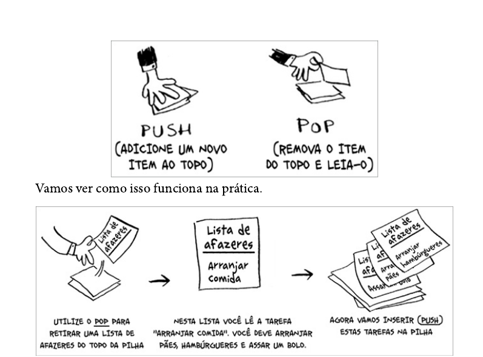
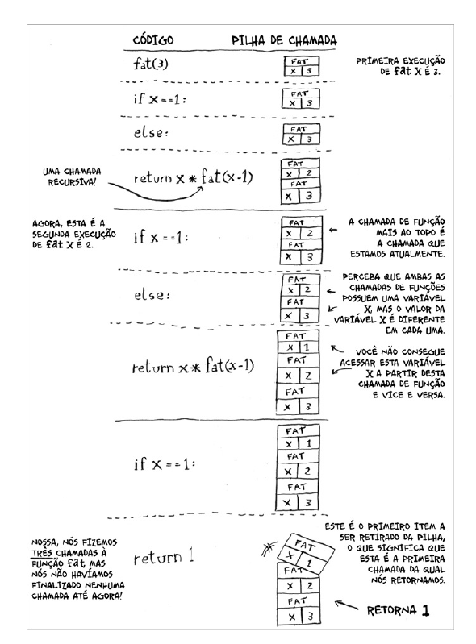
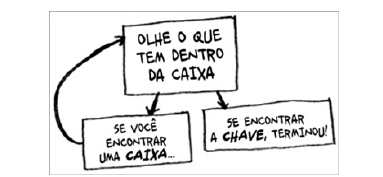
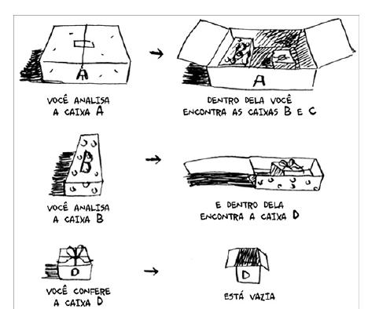

# Recursão

## O que é recursão?

Recursão é um conceito em que uma função chama a si mesma. Isso é útil quando você precisa resolver um problema que pode ser dividido em subproblemas menores.

> Esta caixa contém mais caixas com mais caixas dentro delas. A chave está em alguma destas caixas. Qual é o seu algoritmo para procurá-la? Pense nisso antes de continuar a leitura.


### Exemplo iterativo

```
def procure_pela_chave(caixa_principal):
    pilha = main_box.crie_uma_pilha_para_busca()
    while pilha is not vazia:
        caixa = pilha.pegue_caixa()
        for item in caixa:
            if item.e_uma_caixa():
                pilha.append(item)
            elif item.e_uma_chave():
                print("achei a chave!")

```
### Exemplo recursivo

```
def procure_pela_chave(caixa):
    for item in caixa:
        if item.e_uma_caixa():
            procure_pela_chave(item)
        elif item.e_uma_chave():
            print("achei a chave!")

```

As duas formas resolvem o problema, mas a recursão é mais elegante e fácil de entender.

> Os loops podem melhorar o desempenho do seu programa. A recursão melhora o desempenho do seu programador. Escolha o que for mais importante para a sua situação. "Leigh Caldwell, do Stack Overflow"


# Caso-base e caso recursivo

A premissa da recursividade é que você tem uma função que chama a si mesma. facilmente podemos cair em um loop infinito. Portanto, é importante ter um caso-base que determina quando a função recursiva deve parar.


## Exemplo de recursão

```go
// conta a até 10 de forma recursiva

func contaAte(n int) {
	n = 0
	if n == 10 // caso base
		fmt.Println("Cheguei a 10!")
        return
	fmt.Println(n)
	contaAte(n + 1) // caso recursivo
}

```

# A pilha

Pilha é uma estrutura de dados que segue o princípio LIFO (Last In, First Out). Isso significa que o último elemento a ser adicionado à pilha é o primeiro a ser removido

* **push**: adiciona um item à pilha
* **pop**: remove o item mais recente adicionado à pilha



## A pilha de chamada

Quando uma função é chamada, o computador aloca um espaço na memória para armazenar as variáveis locais e os parâmetros da função. Isso é chamado de quadro de ativação. O computador mantém uma pilha de quadros de ativação, chamada de pilha de chamada.

## A pilha de chamada e a recursão

A pilha de chamada é usada para armazenar os quadros de ativação das funções que estão sendo chamadas. Quando uma função é chamada, um novo quadro de ativação é adicionado à pilha. Quando a função retorna, o quadro de ativação é removido da pilha.

exemplo:

```go
package main

import (
	"fmt"
)

func fat(n int) int {
	if n == 0 { // caso base
		fmt.Println("Cheguei no caso base")
		return 1
	}
	fmt.Println("Calculando fat(", n, ") - caso recursivo")
	return n * fat(n-1)
}

func main() {
	fmt.Println(fat(3))
}

```


Cada hamda tem seu proprio valo de n, e cada chamada tem seu proprio quadro de ativação. Quando a função retorna, o quadro de ativação é removido da pilha.






### exercícios

Suponha que você acidentalmente escreveu um programa que entra em um loop infinito.  Como você viu, seu computador aloca memória na pilha para cada chamada de função. O que acontece com a pilha quando a função recursiva ca executando infinitamente?

- **Resposta**: O computador eventualmente ficará sem memória e lançará um erro de estouro de pilha.

## Recapitulando

* A recursão é um conceito em que uma função chama a si mesma.
* A recursão tem um caso-base que determina quando a função deve parar e um caso recursivo que chama a função novamente.
* Todas as chamadas de função são armazenadas na pilha de chamada.
* A pilha de chamada pode car muito grande e ocupar muita memória.

