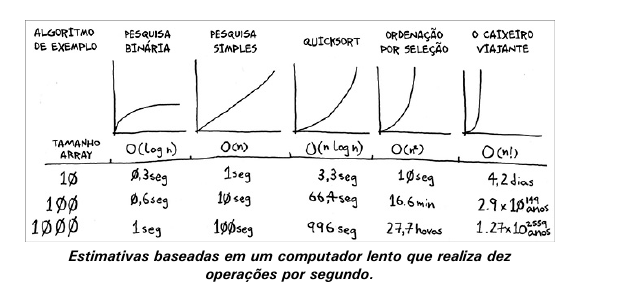
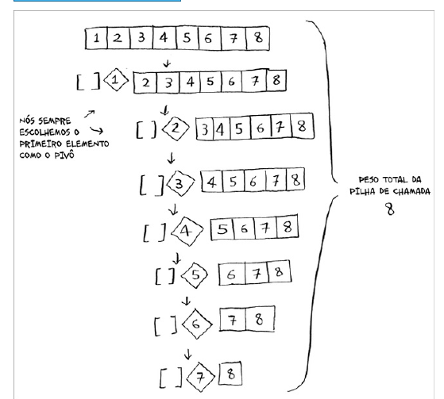

# quicksort

## Dividir para conquistar

é uma tecnica de resolução de problemas que consiste em dividir um problema em subproblemas menores, resolvê-los e combinar suas soluções para resolver o problema original. Os algoritmos de DC podem ser resolvidos de forma recursiva.

## Quicksort

O quicksort é um algoritmo de ordenação. Este algoritmo é muito mais rápido do que a ordenação por seleção e é muito utilizado na prática. Por exemplo, a biblioteca-padrão da linguagem C tem uma função chamada qsort, que é uma implementação do quicksort. O algoritmo quicksort também utiliza a estratégia DC.

```go
package main

import "fmt"

func quicksort(lista []int) []int {
	// condição de parada
	if len(lista) < 2 { // condição base quando o array é igual a 1 ou zero
		return lista
	} else { // condição recursiva
		pivo := lista[0]
		menores := []int{}
		maiores := []int{}

		for _, v := range lista[1:] {
			if v <= pivo {
				menores = append(menores, v)
			} else {
				maiores = append(maiores, v)
			}
		}

		return append(append(quicksort(menores), pivo), quicksort(maiores)...)
	}
}

func main() {
	lista := []int{10, 5, 2, 3}
	fmt.Println(quicksort(lista))
}
```

## Notação Big O revisada



## Notação Big O revisada

Os exemplos de tempos de execução contidos nestes gráficos são estimativas para um caso em que você executa dez operações por segundo. Estes gráficos não são precisos, mas servem apenas para fornecer um exemplo do quão diferentes são os tempos de execução. Na realidade, o seu computador é capaz de executar muito mais do que dez operações por segundo.

Cada tempo de execução contém um algoritmo de exemplo anexo. Dê uma olhada no algoritmo de ordenação por seleção, que você aprendeu no Capítulo 2. O seu tempo de execução é O(n²); é bastante lento.

Há outro algoritmo de ordenação chamado merge sort, que tem tempo de execução O(n log n), o que é muito mais rápido! O algoritmo quicksort é um caso complicado. Na pior situação, o quicksort tem tempo de execução O(n²). Ele é tão lento quanto a ordenação por seleção! Porém, este é o pior caso possível. No caso médio, o quicksort tem tempo de execução O(n log n). E agora você pode estar se perguntando:

- O que significa pior caso e caso médio?
- Se o quicksort tem tempo de execução médio O(n log n), e o merge sort tem tempo de execução O(n log n) sempre, por que não utilizar o merge sort? Não seria mais rápido?

## Merge sort vs quicksort

Ambos os algoritmos têm complexidade O(n log n), mas o quicksort é mais rápido na prática. Para efeito de cálculo, consideramos apenas o O(n log n). Porém, às vezes, a constante pode fazer diferença. O quicksort, comparado ao merge sort, é um exemplo disso. O quicksort tem uma constante menor do que o merge sort. Assim, como ambos têm tempo de execução O(n log n), o quicksort acaba sendo mais rápido. Além disso, o quicksort é mais rápido na prática, pois ele funciona mais vezes no caso médio do que no pior caso.

E agora você pode estar se perguntando: o que é o caso médio e o que é o pior caso?

## Caso médio e pior caso

O desempenho do quicksort depende bastante da escolha do pivô. Imagine que você sempre escolha o primeiro elemento como pivô e que você execute o quicksort em um array que já esteja ordenado. O quicksort não faz uma checagem para conferir se o array já está ordenado. Logo, ele tentará ordenar o array mesmo assim.




## Caso Médio e Pior Caso

Neste exemplo, existem O(log n) níveis (a maneira mais técnica de dizer isso é "O peso da pilha de chamada [ou pilha de execução] é O(log n)"). Cada nível tem tempo de execução O(n). Portanto, o algoritmo como um todo tem tempo de execução O(n) * O(log n) = O(n log n). Este é o melhor caso.

No pior caso, existem O(n) níveis. Portanto, o algoritmo tem tempo de execução O(n) * O(n) = O(n²).

Adivinhe? O melhor caso também é o caso médio. Se você sempre escolher um elemento aleatório do array como pivô, o quicksort será completado com tempo de execução médio O(n log n). O algoritmo quicksort é um dos mais rápidos algoritmos de ordenação que existem, sendo um ótimo exemplo de DC (Dividir para Conquistar).

```go
package main

import (
	"fmt"
	"math/rand"
	"time"
)

func quicksort(lista []int) []int {
	// condição de parada
	if len(lista) < 2 { // condição base quando o array é igual a 1 ou zero
		return lista
	} else { // condição recursiva
		r := rand.New(rand.NewSource(time.Now().UnixNano()))
		pivoIndex := r.Intn(len(lista))
		pivo := lista[pivoIndex]
		menores := []int{}
		maiores := []int{}

		for i, v := range lista {
			if i == pivoIndex {
				continue
			}
			if v <= pivo {
				menores = append(menores, v)
			} else {
				maiores = append(maiores, v)
			}
		}

		return append(append(quicksort(menores), pivo), quicksort(maiores)...)
	}
}

func main() {
	lista := []int{10, 5, 2, 3}
	fmt.Println(quicksort(lista))
}


```


## Exercícios

Quanto tempo levaria, em notação Big O, para completar cada uma destas
operações?

Imprimir o valor de cada elemento em um array.
R - O(n), pois você precisa imprimir cada elemento do array, item por item.


Duplicar o valor de cada elemento em um array.

R - O(n), pois você precisa duplicar cada elemento do array, item por item.

Duplicar o valor apenas do primeiro elemento do array.

R - O(1), pois você só precisa duplicar o primeiro elemento do array- constante.

Criar uma tabela de multiplicação com todos os elementos do array.

R - O(n²), pois você precisa multiplicar cada elemento do array por todos os outros elementos do array.

## Recaptulando

- A técnica de Dividir para Conquistar é uma maneira de resolver problemas dividindo
- O quicksort é um algoritmo de ordenação que utiliza a técnica de Dividir para Conquistar, se usamos o pivô de forma aleatória, o tempo de execução médio e melhor caso é O(n log n)
- o Big O é uma notação que descreve o quão rápido um algoritmo cresce em relação ao número de elementos que ele opera é está é a razão pela qual o quicksort é mais rápido que o merge sort na prática.
- A constante dificilmente será relevante na comparação entre pesquisa simples e pesquisa binária, o mesmo não se aplica a comparação entre quicksort e merge sort. Porém para arrays pequenos, a pesquisa simples pode ser mais rápida que a pesquisa binária o que não se aplica a comparação entre quicksort e merge sort.
