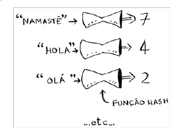
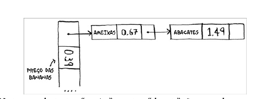
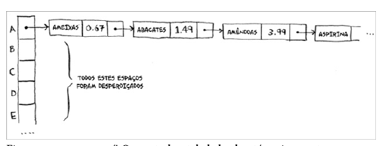
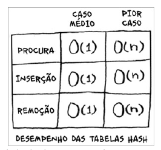
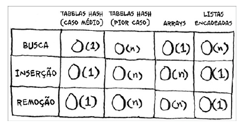
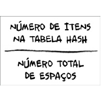

# Tabela hash

## Funções de hash

Uma função hash é uma função na qual você insere uma string1 e, depois disso, a função retorna um número.





Coloque uma função hash em conjunto com um array e você terá uma estrutura de dados chamada tabela hash.Uma tabela hash é a primeira estrutura de dados que tem uma lógica adicional aliada que você aprenderá, visto que arrays e listas mapeiam diretamente para a memória, porém as tabelas hash são mais inteligentes. Elas usam uma função hash para indicar, de maneira inteligente, onde armazenar os elementos.


## exemplo em go

```go

package main

import (
	"fmt"
)

func main() {
	// Criando uma tabela hash
	hashTable := make(map[string]int)

	// Adicionando elementos
	hashTable["um"] = 1
	hashTable["dois"] = 2
	hashTable["tres"] = 3

	// Acessando elementos
	fmt.Println(hashTable["um"])
	fmt.Println(hashTable["dois"])
	fmt.Println(hashTable["tres"])
}

```

## Evitando entradas duplicadas

Uma das principais vantagens de usar uma tabela hash é que ela evita entradas duplicadas. Se você tentar adicionar um elemento que já existe, ele será substituído pelo novo valor. Isso é muito útil para evitar que você tenha que verificar manualmente se um elemento já existe antes de adicioná-lo.

```go

package main

import (
	"fmt"
)

func main() {
	// Criando uma tabela hash
	hashTable := make(map[string]int)

	// Adicionando elementos
	hashTable["um"] = 1
	hashTable["dois"] = 2
	hashTable["tres"] = 3

	// Adicionando um elemento que já existe
	hashTable["um"] = 10

	// Acessando elementos
	fmt.Println(hashTable["um"])
	fmt.Println(hashTable["dois"])
	fmt.Println(hashTable["tres"])
}

```

## Colisões

Uma colisão ocorre quando duas chaves diferentes são mapeadas para o mesmo índice na tabela hash. Isso pode ser um problema, pois você pode acabar perdendo um elemento se ele for substituído por outro que tenha a mesma chave. Para isso há várias alternativas, e a mais simples é esta: se diversas chaves mapeiam para o mesmo espaço, inicie uma lista encadeada neste espaço.





## Desempenho







## Fator de carga

O fator de carga é a razão entre o número de elementos na tabela hash e o número de slots disponíveis. Se o fator de carga for muito alto, a tabela hash terá muitas colisões e o desempenho será ruim. Para evitar isso, você pode aumentar o tamanho da tabela hash quando o fator de carga ultrapassar um determinado limite.



## uma boa função hash

Uma boa função hash distribui os valores no array simetricamente.


## Recapitulando

As tabelas hash são estruturas de dados poderosas, pois elas são muito rápidas e possibilitam a modelagem de dados de uma forma diferente. Logo você estará utilizando-as o tempo todo:

- Você pode fazer uma tabela hash ao combinar uma função hash com um array.
- Colisões são problemas. É necessário haver uma função hash que minimize colisões.
- Tabelas hash são boas para modelar relações entre dois itens.
- Se o seu fator de carga for maior que 0,7, será necessário redimensionar a sua tabela hash.
- As tabelas hash são utilizadas como cache de dados (como em um servidor da web, por exemplo).
- Tabelas hash são ótimas para localizar duplicatas.
-
