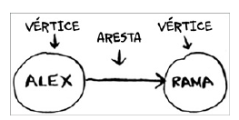

# Pesquisa em largura


## Introdução a grafos

Grafos são estruturas de dados que consistem em um conjunto de vértices e um conjunto de arestas que conectam esses vértices. Eles são usados para representar relacionamentos entre objetos, como redes de computadores, redes sociais, mapas de cidades, etc.


- Vértices: são os pontos de um grafo. Eles são representados por círculos ou pontos.
- Arestas: são as linhas que conectam os vértices. Elas representam os relacionamentos entre os vértices.
- Direcionado: um grafo direcionado é um grafo em que as arestas têm uma direção. Isso significa que você pode ir de um vértice para outro, mas não necessariamente de volta.
- Não direcionado: um grafo não direcionado é um grafo em que as arestas não têm uma direção. Isso significa que você pode ir de um vértice para outro e vice-versa.



## Pesquisa em largura

A pesquisa em largura é um algoritmo usado para percorrer ou pesquisar um grafo. Ele começa em um vértice inicial e explora todos os vértices vizinhos antes de se mover para os vértices vizinhos desses vértices. Isso é feito de forma iterativa, usando uma fila para armazenar os vértices que ainda
precisam ser explorados.

- Existe algum caminho do vértice A até o vértice B?
- Qual é o caminho mais curto do vértice A até o vértice B?

## Conexão entre vértices

- Conexão direta(primeiro grau): se dois vértices estão conectados por uma aresta, eles são considerados conectados diretamente.
- Conexão indireta(segundo grau): se dois vértices estão conectados por um vértice intermediário, eles são considerados conectados indiretamente.
- Conexão transitiva: se dois vértices estão conectados por uma sequência de vértices, eles são considerados conectados transitivamente.

## filas

Uma fila é uma estrutura de dados que segue o princípio FIFO (First In, First Out). Isso significa que o primeiro elemento a ser inserido na fila é o primeiro a ser removido. As operações básicas em uma fila são:


```go
package main

import (
	"fmt"
)

func pessoa_e_vendedor(nome string) bool {
	return nome[len(nome)-1] == 'm'
}

var grafo = map[string][]string{
	"voce":   {"alice", "bob", "claire"},
	"bob":    {"anuj", "peggy"},
	"alice":  {"peggy"},
	"claire": {"thom", "jonny"},
	"anuj":   {},
	"peggy":  {},
	"thom":   {},
	"jonny":  {},
}

func pesquisa(nome string) bool {
	fila := []string{nome}
	verificados := make(map[string]bool)

	for len(fila) > 0 {
		pessoa := fila[0]
		fila = fila[1:]

		if !verificados[pessoa] {
			fmt.Println("Verificando " + pessoa)
			if pessoa_e_vendedor(pessoa) {
				fmt.Println(pessoa + " é um vendedor de manga!")
				return true
			}
			verificados[pessoa] = true
			fila = append(fila, grafo[pessoa]...)
		}
	}

	return false
}

func main() {
	if !pesquisa("voce") {
		fmt.Println("Nenhum vendedor de manga encontrado.")
	}
}


```

## Recaptulando

- A pesquisa em largura lhe diz se há um caminho de A para B.
- Se houver um caminho, a pesquisa em largura lhe dará o caminho mais curto.
-  Se você tem um problema do tipo “encontre o menor X”, tente modelar o seu problema utilizado grafos e use a pesquisa em largura para resolvê-lo
-  Filas são FIFO (primeiro a entrar, primeiro a sair).
-  Pilhas são LIFO (último a entrar, primeiro a sair).
-  Você precisa veri car as pessoas na ordem em que elas foram adicionadas
à lista de pesquisa. Portanto a lista de pesquisa deve ser uma la; caso contrário, você não obterá o caminho mínimo.
- Cada vez que você precisar veri car alguém, procure não veri cá-lo novamente. Caso contrário, poderá acabar em um loop in nito.
